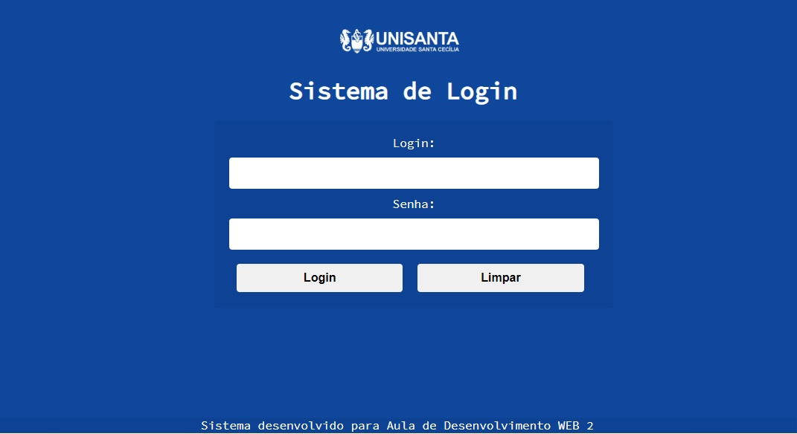
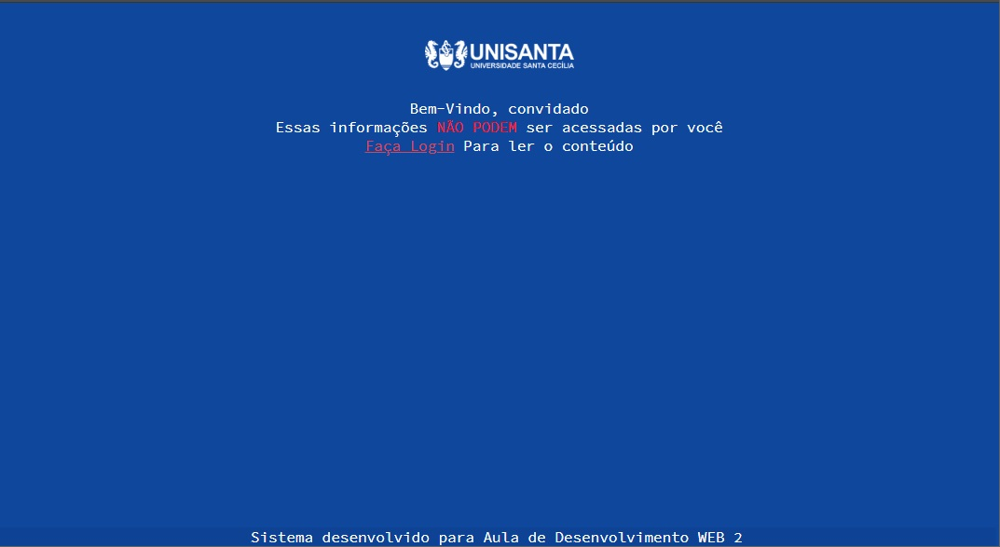

# Sistema-de-Login
 > Sistema de Login utilizando sessão e banco de dados mysql 






## Configuração
Configuração do arquivo autenticarCliente.php
```sh
$server = "localhost";
$bd = ""; /*BANCO DE DADOS*/
$user = ""; /*Usuario*/
$pass = ""; /* Senha */
$con = mysqli_connect($server, $user, $pass);
```


## Historico

* v1.0
    * Sistema iniciado

## Meta

Leandro Bento Bergamo  – [WebSite](www.leandrobergamo.dev) – leandro.bergamo@hotmail.com


[https://github.com/lbbergamo/](https://github.com/lbbergamo/)