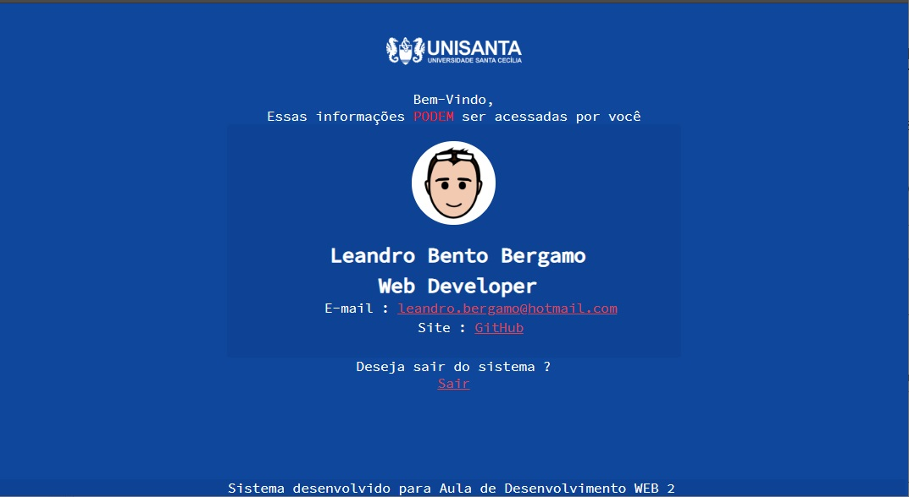

# Sistema-de-Login-Modo-Antigo 
 > Sistema de Login utilizando sessão e banco de dados mysql - Modo Antigo


_O PHP costumava vir com a extensão original do MySQL built-in que suporta as versões mais antigas do MySQL. No entanto, essa extensão foi reprovada em favor do MySQLi (i de improved/melhorado). Ao mesmo tempo, o PHP continuou a evoluir e a extensão PDO (PHP Data Objects) foi introduzida para se tornar uma interface comum para acessar muitos tipos de banco de dados._





## Configuração
Configuração do arquivo autenticarCliente.php
```sh
$server = "localhost";
$bd = ""; /*BANCO DE DADOS*/
$user = ""; /*Usuario*/
$pass = ""; /* Senha */
$con = mysqli_connect($server, $user, $pass);
```


## Historico
* v1.1 
    * Alteração do README.md
        * Inclusão de explicação do PHP - BD
* v1.0
    * Sistema iniciado

## Meta

Leandro Bento Bergamo  – [WebSite](www.leandrobergamo.dev) – leandro.bergamo@hotmail.com


[https://github.com/lbbergamo/](https://github.com/lbbergamo/)
